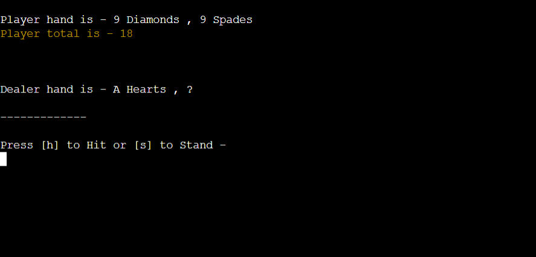

# BLACKJACK

 

This is your typical game of Blackjack using python backend programming to complete. The game is aimed at a natural flowing game flow returning as good user experience. Inputs are used throughout provide constant interaction with the user along with cues for any ease of use. The user (you) begins the game with 1000 coins. You then place your wager and draw card. The dealer (computer) gets dealt two cards also however one is hidden. You are then presented with the option to 'hit' or 'stand'. If hit is chosen the user draws another card and if not bust is goven the option  of 'hit' or 'stand' again. If stand is chosen then the dealers cards are shown. If the dealer is under 17 then they have to automatically hit. If they are between 17 and 21 then the dealer and user scores are compared. If either player goes bust, the other wins. The aim is to get as close to 21 as possible. If you reach 21 Blackjack is declared. Otherwise the player with the highest total is the winner. If it is a draw its called a push. Once a winner/loser/draw is determined our winngs/losses will be adjusted accordingly.

   

[View Blackjack live game on Github pages here](https://blackjack-pp3.herokuapp.com/)

---

## FLOW CHART

This flow chart was used to design the game.

 

## Features
---

 

### Start up

The game begins with the word Blackjack in red ASCII text. It then tells you to input your username. This input will need to be between 3 and 10 characters. If invalid data is given, a message is returned using a while loop reiterating the conditions for it to be successful.

 

### Instructions choice

The user is given the option to start the game or read the instruction. Invalid data will not be accepted. This again is done through a while loop. If s is entered then move on, if i chosen then the user is brought to the instructions page.

 

### Instructions

The user is shown the way the game works and then given the choice of playing the game or returing to the start up scrren, again using an input for the response.

 

### Place bet

The user is asked to input a wager that has to be a minimum of 10 and and a multiple of 5. A Value Error is returned if not inputted correctly. The users coins are shown at the top left hand corner of the screen. This figure increase and decreases depending on whether you win or lose.

 

### Cards are dealt and hit or stand option given

The cards are dealt using the random module.  One of the dealer's cards is hidden. An option is presented to the user, to hit or stand. If h is entered then an additional card is dealt and the users total is adjusted to accomodate the new card. If stand it moves on to check the dealers hand.

 

### Check dealer card and winnning hand

If user is not gone bust then the dealers hand is revealed. If the dealer is between 17 and 21 it automatically stands and the total scores are compared in winng hand function. If the dealer's total is under 17 then they draw an additional card until they either go bust or go higher than 17, this is done using a while loop. The winning hand function compares the 2 totals and declares a winner based on if/elif statements.

 

### Go again

If the user runs out of coins then the game resets and goes back to the start up screen. GOODBYE is printed for a brief time using the time module and using ASCII text. If the user still has coins left then he is giving the option to play again or to quit. If play again is entered the main function is called and a new is started. If q is chosen the user returns to the start up screen.

 

### Python modeules used:
  * import os - used to clear system once implemented in the clear function.
  * import random - used to randomly choose a card for the deck.
  * import time - used time.sleep to display text for brief periods.
  * import pyfiglet - used to add ASCII text 
  * import termcolor -  used to add color to text

   

## Future Implementations:
  * Use ASCII to actually display cards rather than stating them in standard text.
  * Use a class for card which would reduce a lot of lines of code resulting in it being more efficient.
  * When dealing is displayed on the screen an audio sound of cards being shuffled would be a nice additional feature.
  * Create a virtual casino by adding more game options to choose from.

   

## Technologies Used

 

### Languages Used

 

* Python

 

### Frameworks and Programs Used

* Git - This was used for version control.
* Github - This was used to save and store all the files for the website.
* Am I Responsive - This was used to show the website on a variety of different screens.
* Code Institute template was used to create this project on Gitpod.
* Heroku was used for deployment.

 

## Testing

 

### CI Python Linter

The CI Python Linter was used on every aspect of Python in the project. No errors were returned.

 

### Manual Testing

* I have gone through every input making sure invalid inputs will not be accepted. Invalid inputs: strings when numbers required, out of bound inputs, below minimum  and maximum requirements inputs and in the place bet function an input that is not a multiple of 5 or exceeds the total coins of the user.
* Tested in my local terminal and the Code Institute Heroku terminal.

   

### Solved Bugs

 

1. When implementing the player_coins variable in the main() function the wager amount was not being added or subtracted after every round. However once I removed it from the main function and start_up function and put it in the global scope it was resolved.

2. When an ace card was dealt the code I had written for aces was not working correctly distinguishing between 1 and 11. After doing some research I found a way to count the aces, so if an 'A' is drawn the ace count goes up one. If the value is over 21 then the total minuses 10 and the ace count subtracts 1.

3. In the check_dealer_hand, when the user went bust it was reporting an error. Throught the help of my mentor we realised it was a simple fix of g=the go_again() function required to be called up as it was leading to nothing otherwise.

 

### Known Bugs

 

In the run.py file no line length exceeds 80. However in the terminal some words in the instructions carry on to the next line which is not aesthetically pleasing. This can be solved with shorter sentences and more line breaks.